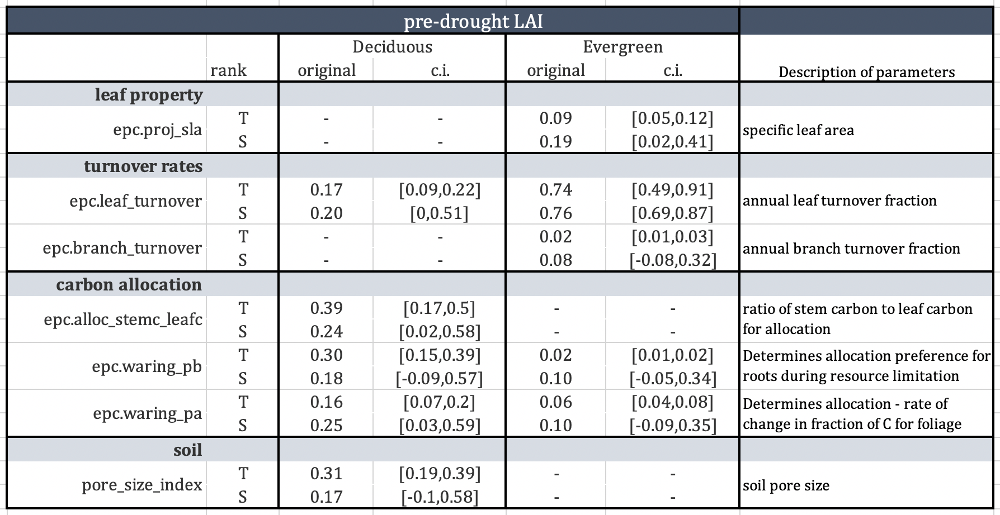
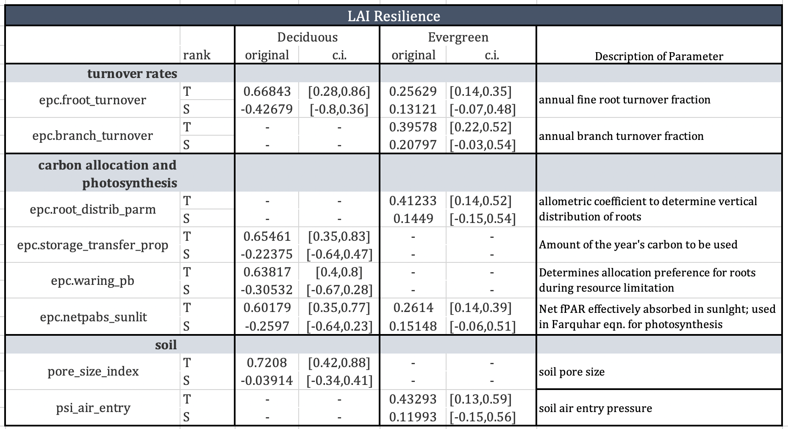

```{r setup, include=FALSE}
"../../../"
knitr::opts_chunk$set(echo = FALSE, message = FALSE, warning = FALSE)
library(RHESSysIOinR)
library(tidyverse)
library(data.table)
library(patchwork)
source("../../R/readin_selected_vars.R")
source("~/climatefiles/mkwy.R")
#source("~/Documents/GitHub/climfiles/mkwy.R")
source("../../R/relativeresilience.R")

library(wesanderson)
climpal <- wes_palette("FantasticFox1", 5, type = "discrete")[2:5]
ColsVec<- c(climpal[2], climpal[1], climpal[3], climpal[4])

```

## 1. Model output compared to data

After filtering the model outputs of LAI for the year 2011 to be within the range of estimated LAI and filtering by percent changes to LAI during the drought for each tree species, parameters were compiled into ensemble sets. Out of more than 5,000 parameter sets used in the sensitivity analysis, we ended up with 366 for coast live oak, 533 for victorian box, 404 for canary island pine, 86 eucalyptus, and 217 california sycamore (Table). 
</br>

**add columns of median 2016 resistance and resilience for each species, each climate scenario - see which is most sensitive to the changes** 


Tree | LAI range (Alonzo et al. 2016) | median modelled LAI | Filtered parameter sets (n)
-----|--------------------------------|---------------------|--------------------
QUAG | 3.33 - 5.21                    | 3.84                | 366   
EUGL | 4.22 - 6.29                    | 4.47                | 153               
PICA | 3.82 - 9.02                    | 4.34                | 404                
PIUN | 2.82 - 5.5                     | 3.95                | 533                
PLRA | 3.75 - 6.14                    | 4.12                | 217               


Model outputs of LAI for the year 2011 fell within the range of estimated LAI for each species, although the median of the parameter ensembles is slightly lower than the median of the remotely sensed data. In Kendall rank correlation tests, all of the tree species show positive association between the modelled and observed LAI values, with significant p-values. 

We used percent changes in NDVI to compare with changes in LAI in the model. We had NDVI data from 2011, a pre-drought wet year, 2014, the warmest year of the drought, and 2017, a wet year following the drought period. 

Parameter ensembles were filtered to be within the range of percent differences between 2011-2014 and 2011-2017. To test for similarities between the two sets of percent differences, the modelled outputs were randomly sampled from each tree species parameter ensemble to 50 sets, and tested against 50 percent differences in NDVI using a Mann-Whitney test. The results were variable across tree species: QUAG, PICA, and PLRA had significant differences in the decline in LAI / NDVI from 2011-2014. Only EUGL and PLRA show significant differences for the 2011-2017 percent differences. Despite these differences in medians, the results for each tree species parameter ensemble fall within the range of the data. 

</br>

```{r load, echo=F, eval=T}
#setwd("~/Desktop/VegParamsSA/out/plot")
setwd("~/VegParamsSA/out/plot")
proj = c("hist","hot","hotter","lower")
spec = c("quag", "piun","pica","eugl","plra")
vars = c("lai", "plantc", "plant_resp", "gpsn", "height", "cpool", "trans", "precip", "resp")
#vars = c("lai", "plantc", "gwseasonday", "lfseasonday", "gsi")


readout = matrix(ncol=17)
for(i in 1:length(proj)){
  for(j in 1:length(spec)){
    df <- readin_selected_vars(vars = vars,
                                dir = paste(proj[i],
                                            spec[j],
                                            "allsim",
                                            sep="/")) %>%
      mutate(code = spec[j], 
             climmod = proj[i])
    
    colnames(readout) <- colnames(df)
    readout = rbind(readout,df)
  }
}

readout <- readout[-1,]
readout$date = as.Date(paste(readout$year, readout$month, readout$day, sep="-"))
readout <- mkwy(readout) %>% mutate(npp = gpsn-resp) %>% dplyr::select(-variable) 

readout$climmod[readout$climmod=="lower"] <- "cooler"

```

```{r loadin, include=F, message=F}
group_tree <- function(name, year=TRUE){

 tbl <- readRDS(paste(name,"outputs.rds", sep="_"))

  if(year==T){
    tmp <- tbl %>% group_by(year, run) %>% summarize_at(vars(lai, plantc), funs(mean)) %>% mutate(code=name)
  } else {
    tmp <- tbl %>% group_by(yd) %>% summarize_at(vars(lai, plantc), funs(mean)) %>% mutate(code=name)
  }
  
  return(tmp)
}

## load in and create df 
trees2 <- list("quag","piun","pica", "eugl", "plra")
get_year2 <- lapply(trees2, group_tree)
dfyr2 <- do.call(rbind.data.frame, get_year2)

dfyr <- dfyr2 %>% 
  group_by(year, code) %>% summarize_all(funs(mean))

lai_comp = dfyr2 %>% ungroup() %>%  dplyr::filter(year==2011) %>% 
  group_by(code) %>% 
  summarize_at(vars(lai), list(mean, median))

```


```{r ndvi_dat, echo=F}
annp <- readout %>% dplyr::filter(code=="quag" & run==1 & climmod=="hist") %>%
  group_by(wy) %>% 
  summarize_at(vars(precip), list(sum)) %>%
  dplyr::filter(wy < 2018) %>% 
  mutate(data_year = ifelse(wy==2011 | wy==2014 | wy==2017,
                            0, 1))

precip_plot <- ggplot(annp) + 
  geom_col(aes(x=wy, y=precip, fill=as.factor(data_year)), show.legend=F) +
  geom_hline(aes(yintercept=451.44), linetype="dashed") +
  scale_fill_brewer(palette="Dark2") + labs(x="water year", y="precipitation [mm]")

vis <- read.csv("../../data/tree_and_turfgrass_monroe2_selected_weightedmeanVIs.csv")

trees_vi <- vis %>% dplyr::filter(sp_class==81|
                                    sp_class==74|
                                    sp_class==73|
                                    sp_class==66|
                                    sp_class==34)

model_pc <- dfyr2 %>% ungroup() %>%
  dplyr::filter(year ==2011 | year==2014 | year==2017) %>% 
  pivot_wider(values_from=lai, names_from=year,  id_cols=c(run,code)) %>%
  mutate(`2014` = (`2014`-`2011`)/`2011`) %>% 
  mutate(`2017` = (`2017`-`2011`)/`2011`) %>%
  mutate(data="rhessys LAI") %>%
  dplyr::select(ID = run, sp_code=code, `2014`,`2017`, data)
model_pc$sp_code = toupper(model_pc$sp_code)

index_pc <- trees_vi %>% 
  dplyr::filter(year ==2011 | year==2014 | year==2017) %>% 
  pivot_wider(values_from=NDVI, names_from=year,  id_cols=c(ID,sp_code)) %>%
  mutate(`2014` = (`2014`-`2011`)/`2011`) %>% 
  mutate(`2017` = (`2017`-`2011`)/`2011`) %>% 
  mutate(data="NDVI") %>% 
  dplyr::select(-`2011`)

perc_changes <- rbind(model_pc, index_pc)

all_trees <- perc_changes %>% 
  mutate(sp_code="all parameters")


pc_plot <- rbind(all_trees, perc_changes) %>% 
  pivot_longer(cols=c(`2014`,`2017`), names_to="change", values_to="perc_diff") %>% 
  ggplot() + 
  geom_hline(aes(yintercept=0), linetype="dashed") + 
  geom_boxplot(aes(x=change, y=perc_diff, col=data), fill='seashell') + 
  facet_wrap('sp_code') + 
  scale_color_brewer(palette="Dark2") +
  theme_bw() + theme(legend.position="top") + 
  labs(y="percent difference to 2011 values") 

precip_plot / pc_plot

```
In the above plot, the variation in the NDVI data is due to different trees (of the same species) within the dataset. The variation in the model LAI is due to parameter uncertainty. 

</br>

## 2. Drought resistance and resilience

We calculated the resistance to drought as the ratio to pre-drought conditions in 2011 during the drought from 2012-2016. We calculated resilience as the ratio to pre-drought conditions in 2011 after a wet season in 2017. We looked at both resistance and resilience for the annual average LAI and net primary production (NPP) 


```{r resilience, eval=T}

res <- readout %>% dplyr::filter(year < 2018) %>% 
  group_by(year, run, code, climmod) %>% 
  summarize(lai = mean(lai), npp=mean(npp)) 
res <- res %>% group_by(run, code, climmod) %>% 
  mutate(resilience = lai/lai[year==2011]) %>%
  mutate(nppr = npp/npp[year==2011])

all_trees <- res %>% dplyr::select(year, climmod, resilience, nppr, lai, npp)  
all_trees$code <- "all trees"


npp_timeser <- rbind(all_trees, res) %>%  
  dplyr::filter(year > 2011 & year < 2018) %>% 
    ggplot() + 
  geom_vline(aes(xintercept=as.factor(2017)), size=6, col='grey') + 
  geom_hline(aes(yintercept=1), linetype='dashed') +
  geom_boxplot(aes(x=as.factor(year), y=nppr, col=climmod), show.legend=T, outlier.shape = NA) +
  scale_color_manual(values=ColsVec) + 
  labs(title="NPP resistance (2012-2016) and resilience (2017)", subtitle="outliers removed", y="ratio to 2011", x="year") + 
   coord_cartesian(ylim = c(-8, 5)) + 
    theme_bw() + theme(text = element_text(size=10), plot.title = element_text(size = 11), legend.position = "top") +
  facet_wrap('code', scales='free')

resist_timeser <-  rbind(all_trees, res) %>% 
  dplyr::filter(year > 2011 & year < 2018) %>% 
  ungroup() %>% 
    ggplot() + 
  geom_vline(aes(xintercept=as.factor(2017)), size=6, col='grey') + 
  geom_hline(aes(yintercept=1), linetype='dashed') +
  geom_boxplot(aes(x=as.factor(year), y=resilience, col=climmod), show.legend=T) + 
  theme_bw() + theme(text = element_text(size=10), plot.title = element_text(size = 11), legend.position = "top") +
  scale_color_manual(values = ColsVec) +
  theme(text = element_text(size=10), plot.title = element_text(size = 11), legend.position = "top") + 
  #scale_x_discrete(guide = guide_axis(check.overlap = TRUE)) +
  facet_wrap('code') +
  labs(title="LAI resistance (2012-2016) and resilience (2017)", 
          y="ratio to 2011", x= "year")

resist_timeser
```
</br>

For LAI resistance and resilience: 

- In the historic drought scenario, most of the trees had a resistance 0.75 or greater, and a resilience of 0.9 or greater 
- Cooler temperatures increased resistance at the beginning of the drought for all trees, but then had lower resilience after the wet year 
- Extreme hot temperatures had the least resistance and lower resilience relative to the other temperature scenarios 
- The victorian box and coast live oak, representative of two broadleaf evergreen trees, both have larger ranges for resistance and resilience to drought, with some of the lowest values dropping below 0.50. 
</br> 

```{r plot_chunk, echo=F}
npp_timeser
```

For NPP resistance and resilience: 

- note: there were some large outliers in these plots that had to be removed.
- For the historical drought, most trees saw the largest decline in the first drought year, and most returned to pre-drought NPP levels in 2017; there was a similar pattern for the two warming scenarios 
- As temperature scenarios increase, the range of responses gets larger; the extreme warming scenario had the largest outliers
- In the cooler temperature scenario, there was less of a range of responses, and less year to year variation. However, the cooler temperatures also resulted in lower resilience values ranging from 0.2 to 0.75, meaning after one wet season only 75% of pre-drought NPP was reached.

</br>


## 3. Interannual changes to carbon fluxes during drought

When looking at changes in transpiration, there are minimal differences across temperature scenarios and trees during drought years. This is likely due to transpiration demands exceeding water availability, so all of the water is used no matter the temperature or tree parameters.

For the below plot, we took the median daily carbon fluxes across all parameter ensembles for each temperature scenario. We separated into drought and wet years, where drought years include 2012-2016 and wet years include 2011 and 2017. 

</br>

```{r carbon, eval=T}

readout <- mkdate(readout)

readout_yd <- readout %>% 
  mutate(dyear = ifelse(wy==2011 | wy==2017, "wet", "drought")) %>%
  mutate(phys = ifelse(code=="plra"|code=="eugl","decid","evg")) %>%
  mutate(leaf = ifelse(code=="pica", "needle","broad")) %>% 
  group_by(yd, climmod, dyear, code) %>%
  summarize_at(vars(gpsn, resp, npp, trans), list(median))


readout_mo <- readout %>% 
  mutate(dyear = ifelse(wy==2011 | wy==2017, "wet", "drought")) %>%
  group_by(month, climmod, dyear, code) %>%
  summarize_at(vars(gpsn, resp, npp, trans), list(median))


gpplot <- readout_yd %>%
  group_by(yd, climmod, dyear) %>%
  summarize_at(vars(gpsn, resp, npp), list(median)) %>%
  pivot_longer(cols = c(gpsn, resp, npp), names_to="cflux") %>%
  mutate(cflux = factor(cflux, levels=c("gpsn","resp","npp"))) %>% 
  ggplot() + 
  geom_line(aes(x=yd, y=value, col=climmod)) +
  geom_hline(aes(yintercept=0, linetype=cflux), show.legend=F) + 
  scale_color_manual(values=ColsVec) + 
  ggtitle("median daily carbon fluxes across all veg. parameters") +
  theme_bw() + labs(x="day of year", y="kgC/m^2") +
  theme(legend.position="top") + facet_grid(cflux ~ dyear)
gpplot


```

- During drought years, GPSN is relatively less in winter compared to wet years, with summer values approaching zero.
- Winter GPSN increases with temperature, but higher temperatures also decrease summer GPSN
- Net respiration amounts generally increase with temperature, but there are relatively small differences across seasons and dry v. wet years
- The median NPP of all scenaerios varies with temperature, although all temperature scenarios include a period of time when the trees become a carbon source during the drought. During wet years the time spent in the summer with negative NPP is less than the drought years. 
- Winter values of NPP are comparable across dry and wet years - the changes in net annual NPP is mainly due to the decrease in summer during drought
- There is a sharper decline from higher winter NPP to summer lows during drought, which is explored more below 
</br>

### Seasonal differences in GPSN scross scenarios 

To further explore the changes to seasonal carbon fluxes during drought, we calculated changes in peak gross photosynthesis for each species parameter ensemble and temperature scenario. We looked at the day of the year when 50% of GPSN is reached to see how drought changes the timing of productivity. 
</br> 

- During drought years, half of the GPSN is reached earlier in the year compared to wet years 
- The changes between tree species may have to do with the leaf-on and leaf-off periods set in the model
- cooler temperatures have longer periods of GPSN through the year, but lower net amounts, while warmer temperatures have higher net amounts, but a shorter season.
</br>

```{r days, eval=T}

readout_yd <- readout %>% 
  mutate(dyear = ifelse(wy==2011 | wy==2017, "wet", "drought")) %>%
  group_by(yd, climmod, dyear, code) %>%
  summarize_at(vars(gpsn, resp, npp, trans), list(median))

prac <- readout_yd %>% 
  dplyr::filter(climmod=="hot" & code=="quag" & dyear=="drought")

# can just sum it up and find the day
# need to get cumulative npp
gethalf <- function(yd, npp){
  
  df <- data.frame(npp=npp, yd=yd)
  #df <- dplyr::filter(df, npp>0)
  df$sumnpp = cumsum(abs(df$npp))
  last=length(df$npp)
  int = df$sumnpp[last]
  
  halfsum=int/2
  ydhalf = df$yd[df$sumnpp>=halfsum]
  day50 <- ydhalf[1]
  
  return(list(int=int, half=day50))
}

tmp2 <- readout %>% 
  mutate(dyear = ifelse(wy==2011 | wy==2017, "wet", "drought")) %>%
  group_by(climmod, dyear, code, run, wy) %>%
  summarise(halfnpp=gethalf(yd=yd, npp=gpsn)$int,
              ydnpp=gethalf(yd=yd, npp=gpsn)$half)

# ggplot(tmp2) + geom_boxplot(aes(x=climmod, y=halfnpp*2, col=dyear)) + facet_wrap('code') + labs(y="gC/m^2", title="net annual GPSN")
# ggplot(tmp2) + geom_boxplot(aes(x=climmod, y=ydnpp, col=dyear)) + facet_wrap('code') + labs(y="day of year", title="day when 50% net annual GPSN")

tmp_summary <- tmp2 %>% 
  group_by(code, climmod, dyear) %>% 
  summarise(
    medianday = median(ydnpp),
    mediannpp = median(halfnpp),
    highday = quantile(ydnpp, 0.95),
    highnpp = quantile(halfnpp, 0.95),
    lowday = quantile(ydnpp, 0.05),
    lownpp = quantile(halfnpp, 0.05))
  

ggplot(tmp_summary) +
  geom_hline(aes(yintercept=0)) + 
  geom_pointrange(aes(x=medianday, xmin=lowday, xmax=highday, y=mediannpp/1000, ymin=lownpp/1000, ymax=highnpp/1000, col=climmod,  shape=dyear)) + theme_bw() +
  scale_color_manual(values=ColsVec) + 
  facet_grid('code') + 
  labs(y="med. of net annual GPSN (gC/m^2)", x="day of year") + 
  ggtitle("median day of year when 50% gpsn is reached")
 

```
</br>

## Discussion

**in discussion add paragraph on species differences - which are most and least sensitive** 

#### 1 .Differences in drought resistance and resilience 

  * Across tree species, temperature scenarios followed a similar pattern for resistance and resilience. While cooler temperatures increased drought resistance for both LAI and NPP, they hindered resilience after the wet year. For warmer temperatures, the resistance decreased during the drought as temperature increased. However, for NPP the warmer temperature scenarios returned to pre-drought levels in 2017. 
  
  * The reduction in LAI after the first couple of drought years is likely due to reduced water availability leading to a decline in re-growth. There is an annual loss of biomass due to senescence, but because of the drought, they are not able to fully replace the loss in LAI. As there is also a decline in NPP during the drought, there is less carbon available to allocate to leaves. The carbon allocation strategy used in the model is based on resource limitation, so it is likely that because of the limited water, carbon was allocated to roots instead of leaves. After the wet season in 2017, all of the trees responded with an increased leaf out, similar to the patterns shown in the increase in NDVI in Miller et al. 2020. 

  * As LAI resistance decreases throughout the drought, NPP resistance shows an increase after the first drought year, which is the lowest year for NPP. This could be due to the decrease in leaf area, causing a decline in respiration.
    + Would GPSN also decline with less leaf area? Is the rate of decline different for each so that NPP is able to balance out?  
 
  * Being in a Mediterranean climate, the majority of productivity occurs during the winter, and the trees are likely adapted to seasonal summer drought where water is conserved but a lower level of productivity is maintained. [cite source]
    + In the case of the first drought year, the sharp decrease in NPP may be due to the inability to maintain the summer photosynthesis while respiration is relatively the same as the previous year, before the tree has reduced LAI and subsequent reduced respiration. 
    + the loss of biomass allows there to be a reduction in maintenence respiration, causing the NPP to increase slightly after first drought year

  * The differences across magnitude and range of tree species LAI and NPP resistance are due to differences in parameters, where parameters relating to turnover rates and carbon allocation play important roles in the resistance and resilience. 
    + Need to look at the differences in the parameters for the different species to describe more here, but will look at waring_pa, leaf_turnover, etc. 
    + How do turnover rates affect drought resilience?
    + Carbon allocation - does this change during a drought to preserve carbon stores for wet year green ups


#### 2. Effects of warming temperatures on seasonal and annual carbon fluxes 

  * During drought, trees become a net carbon source, which is exacerbated by higher temperatures. This is mainly due to a decrease in summer GPSN, with minimal changes to respiration. 
 
  * For net annual photosynthesis and seasonal timing there are distinct differences between wet years and drought years 
    + During wet years, there is a longer season of productivity in the winter extending into summer with lower levels of productivity, but still greater than dry year summer amounts. Compared to drought years, there is a similar amount of winter productivity that drops to zero earlier in the year and stays very low or at zero during the summer. 
    + If the temperatures are cooler the productivity is maintained for longer, although at lower amounts 
During wet years, there are greater differences across temperature scenarios for productivity. This is because during drought, no matter the temperature, productivity is limited by water availability. When it is not limited, the season length of productivity increases with decreasing temperature. 
    + The differences in resilience of NPP between temperature scenarios is mainly due to differences in GPSN. 
  * If the post-drought wet year is at historical or slightly warmer temperatures, it helps recovery of LAI and NPP by increasing growing season length and net annual GPSN. 
  * With cooler temperatures, there is less net GPSN, and less NPP after the post-drought wet year. On the other hand, if temperatures are extremely warm the growing season is shortened. 

#### 4. Species differences across parameters and scenarios 

  * look at median resistance and resilience 
  * differences in turnover rates.. find papers to compare 
  * cite papers that will back up species level differences in response to drought
  * cite that one paper that argues for city forests to be used as experimental labs in terms of warming effects
  * We explore which parameters matter the most for evergreen and deciduous trees in the supplementary information. 

#### 3. Implications for urban tree management and climate change?

  * discuss 'climate-ready' trees 
  * link back to ecosystem services, what does decline in LAI and NPP mean for other processes 
  * need to account for irrigation 

## Supplementary Info 

#### Sensitivity Analysis results

There were two metrics used to look at Sobol indices in the sensitivity analysis. The first was the average LAI in 2011, as the pre-drought conditions. The second was the resilience of LAI, or the ratio of the average LAI in 2017 to the average LAI in 2011. 
</br>

The parameter ranges for the sensitivity analysis differed between evergreen and deciduous tree types, as the limits set on some of the parameters varied enough to do two separate analysis. 
</br> 
For both metrics and tree types, we looked at the parameters with the highest total rank indices. The top 5 for each group are shown in the tables below. 

 
</br>

For the 2011 LAI, evergreen parameters that had the largest sensitivity included leaf and branch turnover rates (epc.leaf_turnover, epc.branch_turnover), specific leaf area (epc.proj_sla), and two waring parameters (epc.waring_pa, epc.waring_pb), which are parameters within RHESSys that affect carbon allocation to leaves and roots, based on the allocation strategy from Landsberg and Waring, 1997. 

For the deciduous type, LAI is also sensitive to the waring parameters and leaf turnover rates, as well as the allocation ratio between stem carbon and leaf carbon (epc.alloc_stemc_leafc). Pore size index was also sensitive for both tree types, which affects how much water is available in the soil. </br>



For LAI drought resilience, there were similar parameters that stood out including leaf and branch turnover rates, and one of the waring parameters. In evergreen trees, the parameter epc.root_distrib_parm was significant; this affects how deep the roots are able to grow. For the deciduous type, fine root turnover was important, as well as carbon parameters including the fraction of carbon to be used each year (epc.storage_transfer_prop), the amount of fPAR used for photosynthesis (epc.netpabs_sunlit). This parameters affects the water use efficiency for photosynthesis. 

Both soil parameters were important for resilience, although the level of importance varied. For broadleaf, resilience was more sensitive to soil air entry pressure (psi_air_entry), and for deciduous it was more sensitive to the pore  size index, similar to the actual pre-drought LAI.

Both soil parameters affect the field capacity, so the LAI and LAI resilience are sensitive to the overall field capacity in the model. Field capacity determines how much water is available to the tree.

</br>

**re-do tables to include all the values for both decid and evg. and each parameter, but bold the ones that were higher or stand out more, rather than blank spots**

