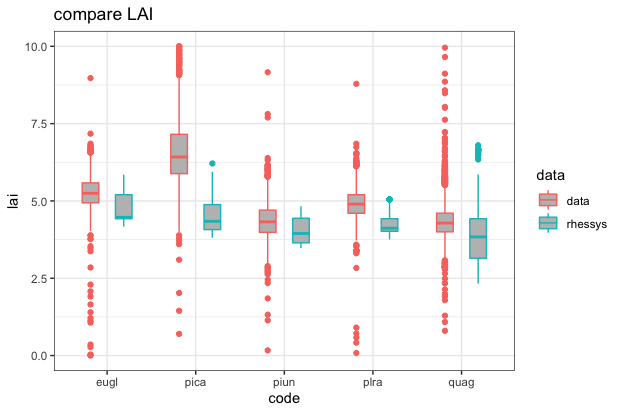
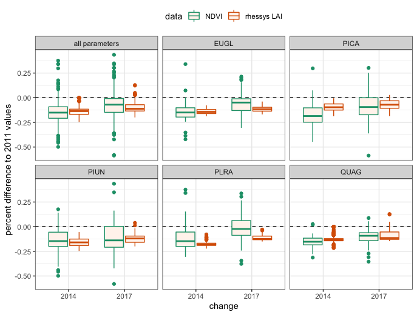

```{r setup, include=FALSE}
"../../../"
knitr::opts_chunk$set(echo = FALSE, message = FALSE, warning = FALSE)
library(RHESSysIOinR)
library(tidyverse)
library(data.table)
library(patchwork)
source("../../R/readin_selected_vars.R")
source("~/Documents/GitHub/climfiles/mkwy.R")
source("../../R/relativeresilience.R")

library(wesanderson)
climpal <- wes_palette("FantasticFox1", 5, type = "discrete")[2:5]
ColsVec<- c(climpal[2], climpal[1], climpal[3], climpal[4])

```

## compare model output with data 

not sure if these plots are necessary, can describe the process and results 

but if keeping, should include number of parameter sets for each tree sp

 
</br>
 


main rhessys outputs:

* bd gpsn	Gross Photosynthesis gC/m2
* bd resp _ Respiration	gC/m2
* npp = gpsn - resp 
* LAI 
* transpiration 

</br>

## Resistance and resilience to drought 

ratio to pre-drought LAI and NPP in 2011 during and after (2017) drought 

```{r load, echo=F}
setwd("~/Documents/patches/out/plot")
proj = c("hist","hot","hotter","lower")
spec = c("quag", "piun","pica","eugl","plra")
vars = c("lai", "plantc", "plant_resp", "gpsn", "height", "cpool", "trans", "precip", "resp")
#vars = c("lai", "plantc", "gwseasonday", "lfseasonday", "gsi")


readout = matrix(ncol=17)
for(i in 1:length(proj)){
  for(j in 1:length(spec)){
    df <- readin_selected_vars(vars = vars,
                                dir = paste(proj[i],
                                            spec[j],
                                            "allsim",
                                            sep="/")) %>%
      mutate(code = spec[j], 
             climmod = proj[i])
    
    colnames(readout) <- colnames(df)
    readout = rbind(readout,df)
  }
}

readout <- readout[-1,]
readout$date = as.Date(paste(readout$year, readout$month, readout$day, sep="-"))
readout <- mkwy(readout) %>% mutate(npp = gpsn-resp) %>% dplyr::select(-variable) 

readout$climmod[readout$climmod=="lower"] <- "cooler"

```


```{r resilience}

annp <- readout %>% dplyr::filter(code=="quag" & run==1 & climmod=="hist") %>%
  group_by(wy) %>% 
  summarize_at(vars(precip), list(sum)) %>%
  dplyr::filter(wy < 2018)

res <- readout %>% dplyr::filter(year < 2018) %>% 
  group_by(year, run, code, climmod) %>% 
  summarize(lai = mean(lai), npp=mean(npp)) 
res <- res %>% group_by(run, code, climmod) %>% 
  mutate(resilience = lai/lai[year==2011]) %>%
  mutate(nppr = npp/npp[year==2011])

# by_code <- res %>% 
#   dplyr::filter(year == 2017) %>% 
#   ggplot() + geom_boxplot(aes(x=code, y=resilience, fill=code), show.legend=F) + ggtitle("resilience = (post-drought LAI)/(pre-drought LAI)") + geom_hline(aes(yintercept=1), linetype='dashed') +
#   theme_bw() + theme(text = element_text(size=10), plot.title = element_text(size = 11)) + facet_wrap('climmod') +
#   xlab('species code') 
# 
# by_clim <- res %>% 
#     dplyr::filter(year == 2017) %>% 
#     ggplot() + geom_boxplot(aes(x=climmod, y=resilience, fill=climmod), show.legend=T) + ggtitle("resilience = (post-drought LAI)/(pre-drought LAI)") + geom_hline(aes(yintercept=1), linetype='dashed') +
#     theme_bw() + theme(text = element_text(size=10), plot.title = element_text(size = 11), legend.position = "top") + facet_wrap('code') +
#     xlab('temp. scenario') 

by_both <- res %>% 
    dplyr::filter(year == 2017) %>% 
    ggplot() + geom_boxplot(aes(x=code, y=resilience, col=climmod), show.legend=T, fill="grey") + 
  ggtitle("resilience = (post-drought LAI)/(pre-drought LAI)") + geom_hline(aes(yintercept=1), linetype='dashed') +
  scale_color_manual(values = ColsVec) + 
    theme_bw() + theme(text = element_text(size=10), plot.title = element_text(size = 11), legend.position = "top") +
    xlab('species code') 
by_both

# by_both_resist <- res %>% 
#     dplyr::filter(year == 2014) %>% 
#     ggplot() + geom_boxplot(aes(x=code, y=resilience, fill=climmod), show.legend=T) + geom_hline(aes(yintercept=1), linetype='dashed') +
#     theme_bw() + theme(text = element_text(size=10), plot.title = element_text(size = 11), legend.position = "top") +
#     xlab('species code') 

resist_timeser <- res %>% 
  dplyr::filter(year > 2011 & year < 2017) %>% 
    ggplot() + 
  geom_hline(aes(yintercept=1)) +
  geom_boxplot(aes(x=as.factor(year), y=resilience, col=climmod), fill='grey', show.legend=T) + #ggtitle("resistence = (drought LAI)/(pre-drought LAI)") + geom_hline(aes(yintercept=1), linetype='dashed') +
    theme_bw() + theme(text = element_text(size=10), plot.title = element_text(size = 11), legend.position = "top") +
  scale_color_manual(values = ColsVec) +
  facet_wrap('code') + 
    xlab('drought year') 
resist_timeser

# res %>% 
#   group_by(year, climmod) %>% 
#   summarize_at(vars(npp), list(median)) %>% 
#   ggplot() + 
#   geom_col(data=annp, aes(x=as.factor(wy), y=precip/500), fill='grey', alpha=0.5) + 
#   geom_line(aes(x=as.factor(year), y=npp, col=climmod, group=climmod)) +
#   #facet_wrap("code")+
#   labs(x='water year', y='NPP[kgC/m^2]', title="annual NPP") +
#   theme(axis.text.x = element_text(size=9, angle=60)) +
#   scale_x_discrete(guide = guide_axis(check.overlap = TRUE)) +
#   theme_bw()


nppresil <- res %>% 
  dplyr::filter(year == 2017) %>% 
  ggplot() + 
  geom_hline(aes(yintercept=1)) + 
  geom_boxplot(aes(x=code, y=nppr, fill=climmod), show.legend=T, outlier.shape=NA) + 
  coord_cartesian(ylim = c(-2, 3)) + 
  ggtitle("resilience = (post-drought net NPP)/(pre-drought net NPP)") + labs(subtitle = "outliers removed") +
  scale_fill_manual(values=ColsVec) + 
  theme_bw() + theme(text = element_text(size=10), plot.title = element_text(size = 11)) + ylab("resilience")
nppresil  

res %>% 
  dplyr::filter(year > 2011 & year < 2017) %>% 
    ggplot() + 
  geom_boxplot(aes(x=as.factor(year), y=nppr, col=climmod), fill='grey', show.legend=T, outlier.shape = NA) +
  scale_color_manual(values=ColsVec) + 
  labs(title="NPP resistance", subtitle="outliers removed", y="resistance", x="drought year") + geom_hline(aes(yintercept=1), linetype='dashed') +
   coord_cartesian(ylim = c(-7, 5)) + 
    theme_bw() + theme(text = element_text(size=10), plot.title = element_text(size = 11), legend.position = "top") +
  facet_wrap('code')

yrng <- range(res$resilience)
res %>% 
  dplyr::filter(year > 2011 & year < 2018) %>% 
    ggplot() + 
  geom_rect(aes(NULL, NULL, xmin=as.factor(2016), xmax=as.factor(2018), ymin=yrng[1], ymax=yrng[2]), fill='grey') + 
  geom_hline(aes(yintercept=1)) +
  geom_boxplot(aes(x=as.factor(year), y=resilience, col=climmod), show.legend=T) + #ggtitle("resistence = (drought LAI)/(pre-drought LAI)") + geom_hline(aes(yintercept=1), linetype='dashed') +
    theme_bw() + theme(text = element_text(size=10), plot.title = element_text(size = 11), legend.position = "top") +
  scale_color_manual(values = ColsVec) +
  facet_wrap('code') + 
    xlab('drought year') 

```
</br>
above plot includes resistance years 2012-2016 and resilience in 2017, which is meant to be shaded to differentiate. Both are ratios of the 2011 LAI. Wasn't quite able to get the shading right but the idea is there I think.


## Annual and seasonal changes in carbon fluxes

```{r water}
water <- readout %>% 
  group_by(wy, climmod, code, run) %>% 
  summarize_at(vars(trans, npp), list(sum)) %>% 
  group_by(wy, climmod) %>% 
  summarize_at(vars(trans, npp), list(median))

transplot1 <- water %>% 
  dplyr::filter(wy<2018) %>% 
  ggplot() + 
  geom_col(data=annp, aes(x=wy, y=precip), fill='grey', alpha=0.5) + 
  geom_line(aes(x=wy, y=trans, col=climmod)) + 
  scale_color_manual(values=ColsVec) + 
  theme_bw() +
  theme(legend.position = 'top') +
  labs(y = "transpiration [mm]", x="water year")
 

nppplot1 <- water %>% 
  dplyr::filter(wy < 2018) %>%
  mutate(npp = npp/1000) %>%
  ggplot() + 
  geom_col(data=annp, aes(x=wy, y=precip/1000), fill='grey', alpha=0.5) +
  geom_line(aes(x=wy, npp, col=climmod, group=climmod), show.legend=F) + 
  scale_color_manual(values=ColsVec) + 
  theme_bw() + labs(x="water year", y="NPP [gC/m^2]")

transplot1 / nppplot1

```


```{r carbon}

readout <- mkdate(readout)

readout_yd <- readout %>% 
  mutate(dyear = ifelse(wy==2011 | wy==2017, "wet", "drought")) %>%
  mutate(phys = ifelse(code=="plra"|code=="eugl","decid","evg")) %>%
  mutate(leaf = ifelse(code=="pica", "needle","broad")) %>% 
  group_by(yd, climmod, dyear, code) %>%
  summarize_at(vars(gpsn, resp, npp, trans), list(median))


readout_mo <- readout %>% 
  mutate(dyear = ifelse(wy==2011 | wy==2017, "wet", "drought")) %>%
  group_by(month, climmod, dyear, code) %>%
  summarize_at(vars(gpsn, resp, npp, trans), list(median))


gpplot <- readout_yd %>%
  group_by(yd, climmod, dyear) %>%
  summarize_at(vars(gpsn, resp, npp), list(median)) %>%
  pivot_longer(cols = c(gpsn, resp, npp), names_to="cflux") %>%
  mutate(cflux = factor(cflux, levels=c("gpsn","resp","npp"))) %>% 
  ggplot() + 
  geom_line(aes(x=yd, y=value, col=climmod)) +
  geom_hline(aes(yintercept=0, linetype=cflux), show.legend=F) + 
  scale_color_manual(values=ColsVec) + 
  ggtitle("median daily carbon fluxes across all veg. parameters") +
  theme_bw() + labs(x="day of year", y="kgC/m^2") +
  theme(legend.position="top") + facet_grid(cflux ~ dyear)
gpplot

# gpplot_dec <- readout_yd %>%
#   dplyr::filter(phys=="decid") %>% 
#   pivot_longer(cols = c(gpsn, resp, npp), names_to="cflux") %>%
#   ggplot() + 
#   geom_line(aes(x=yd, y=value, col=climmod)) +
#   geom_hline(aes(yintercept=0, linetype=cflux), show.legend=F) + 
#   ggtitle("Avg. daily carbon fluxes across all veg. parameters [kgC/m^2]") +
#   theme_bw() + labs(x="", y="GPSN") +
#   theme(legend.position="top") + facet_grid(cflux ~ dyear)

# gpplot_eb <- readout_yd %>%
#   dplyr::filter(phys=="evg" & leaf=="broad") %>% 
#   pivot_longer(cols = c(gpsn, resp, npp), names_to="cflux") %>%
#   ggplot() + 
#   geom_line(aes(x=yd, y=value, col=climmod)) +
#   geom_hline(aes(yintercept=0, linetype=cflux), show.legend=F) + 
#   ggtitle("Avg. daily carbon fluxes across all veg. parameters [kgC/m^2]") +
#   theme_bw() + labs(x="", y="GPSN") +
#   theme(legend.position="top") + facet_grid(cflux ~ dyear)

gpplot_en <- readout_yd %>%
  #pivot_longer(cols = c(gpsn, resp, npp), names_to="cflux") %>%
  ggplot() + 
  geom_line(aes(x=yd, y=npp, col=climmod)) +
  geom_hline(aes(yintercept=0), show.legend=F) + 
  ggtitle("Avg. daily carbon fluxes across all veg. parameters [kgC/m^2]") +
  theme_bw() + labs(x="", y="GPSN") +
  theme(legend.position="top") + facet_grid(code ~ dyear)


```

## Sensitivity Analysis results

should there be a threshold for the indices so that there's not low values in the table? would it depend on first or total, or both? 

```{r table}
library(gt)
library(glue)

dec_lai <- readRDS("../sobol/sens_lai_results.rds") %>% mutate(tree="dec", 
                                                               metric="pre-drought LAI")
dec_res <- readRDS("../sobol/sens_res_results.rds") %>% mutate(tree="dec",
                                                               metric="LAI resilience")
evg_lai <- readRDS("../sobol/sens_lai_results_evg.rds") %>% mutate(tree="evg",
                                                                   metric="pre-drought LAI")
evg_res <- readRDS("../sobol/sens_res_results_evg.rds") %>% mutate(tree="evg",
                                                                   metric="LAI resilience")

allres <- rbind(dec_lai, dec_res, evg_lai, evg_res)

test <- allres %>% 
  dplyr::filter(rank=="T") %>% 
  group_by(tree, metric) %>% 
  arrange(-original) %>% 
  slice(1:5)

test_S = allres %>% 
  dplyr::filter(rank=="S") 

tmp <- left_join(test, test_S, by=c("param","tree","metric"))  
tmp2 <- tmp %>% dplyr::select(
  param, tree, metric,
  original=original.y,
  bias=bias.y,
  `std. error` = `std. error.y`,
  `min. c.i.` = `min. c.i..y`,
  `max. c.i.` = `max. c.i..y`,
  rank = rank.y)


topres = rbind(test, tmp2)

totable <- topres %>%
  dplyr::filter(metric=="pre-drought LAI") %>%
    dplyr::select(-bias, -`std. error`, -metric) %>%
  pivot_wider(id_cols = c(param, rank), values_from = c(original,"min. c.i.", "max. c.i."), names_from=c(tree)) %>%
  mutate(ci_dec = paste("[",round(`min. c.i._dec`,2),",", round(`max. c.i._dec`,2),"]", sep=""),
         ci_evg = paste("[",round(`min. c.i._dec`,2),",", round(`max. c.i._dec`,2),"]", sep="")
         ) %>%
  dplyr::select(-`min. c.i._dec`, -`max. c.i._dec`,
                -`min. c.i._evg`, -`max. c.i._evg`)


totable %>% 
  gt(rowname_col = 'param') %>%
  tab_header(
    title = "Sobol sensitivity analysis",
    subtitle = glue::glue("pre-drought LAI")
  ) %>%
  tab_spanner(
    label="Evergreen",
    columns = c(original_evg, ci_evg)
  ) %>%
  tab_spanner(
    label="Deciduous",
    columns = c(original_dec, ci_dec)
  ) %>%
  tab_row_group(
    label="soil",
    rows='pore_size_index'
  ) %>%
  tab_row_group(
    label="carbon allocation",
    rows=c('epc.alloc_stemc_leafc', 'epc.waring_pa', 'epc.waring_pb')
  ) %>%
  tab_row_group(
    label="turnover rates",
    rows=c('epc.branch_turnover', 'epc.leaf_turnover')
  ) %>%
  tab_row_group(
    label="leaf property",
    rows='epc.proj_sla'
  ) %>%
  fmt_number(
    columns = c(original_dec, original_evg)
  ) 


totable2 <- topres %>%
  dplyr::filter(metric=="LAI resilience") %>%
    dplyr::select(-bias, -`std. error`, -metric) %>%
  pivot_wider(id_cols = c(param, rank), values_from = c(original,"min. c.i.", "max. c.i."), names_from=c(tree)) %>%
  mutate(ci_dec = paste("[",round(`min. c.i._dec`,2),",", round(`max. c.i._dec`,2),"]", sep=""),
         ci_evg = paste("[",round(`min. c.i._dec`,2),",", round(`max. c.i._dec`,2),"]", sep="")
         ) %>%
  dplyr::select(-`min. c.i._dec`, -`max. c.i._dec`,
                -`min. c.i._evg`, -`max. c.i._evg`)

totable2 %>% 
  gt(rowname_col = 'param') %>%
  tab_header(
    title = "Sobol sensitivity analysis",
    subtitle = glue::glue("LAI Resilience")
  ) %>%
  tab_spanner(
    label="Evergreen",
    columns = c(original_evg, ci_evg)
  ) %>%
  tab_spanner(
    label="Deciduous",
    columns = c(original_dec, ci_dec)
  ) %>%
  tab_row_group(
    label="soil",
    rows=c('pore_size_index','psi_air_entry')
  ) %>%
  tab_row_group(
    label="carbon allocation and photosynthesis",
    rows=c('epc.netpabs_sunlit', 'epc.storage_transfer_prop', 'epc.waring_pb')
  ) %>%
  tab_row_group(
    label="turnover rates",
    rows=c('epc.branch_turnover', 'epc.froot_turnover')
  ) %>%
  tab_row_group(
    label="tree property",
    rows='epc.root_distrib_parm'
  ) %>%
  fmt_number(
    columns = c(original_dec, original_evg)
  ) 

```


## Supplementary plots 

```{r npp}

npdf <- readout %>% 
  mutate(npp=npp/1000) %>% 
  #mutate(phys = ifelse(code=="plra"|code=="eugl","decid","evg")) %>%
  #mutate(leaf = ifelse(code=="pica", "needle","broad")) %>%
  group_by(wy, climmod, run, code) %>% 
  summarize_at(vars(npp, gpsn, resp), list(sum))


nppplot2 <- npdf %>% 
  dplyr::filter(wy < 2018) %>%
  group_by(wy, climmod, code) %>% 
  summarize_at(vars(npp), list(median)) %>% 
  ggplot() + 
  geom_col(data=annp, aes(x=as.factor(wy), y=precip/500), fill='grey', alpha=0.5) +
  geom_line(aes(x=as.factor(wy), npp, col=climmod, group=climmod), show.legend=T) + 
  facet_wrap('code', ncol=5) + 
  theme_bw() + labs(x="water year", y="NPP", title = "med. annual NPP") + 
  scale_color_manual(values=ColsVec) + 
  theme(axis.text.x = element_text(size=11, angle=60)) +
  scale_x_discrete(guide = guide_axis(check.overlap = TRUE)) 
nppplot2

# nppplot3 <- npdf %>% 
#   dplyr::filter(wy < 2018) %>%
#   group_by(wy, climmod, phys, leaf) %>% 
#   summarize_at(vars(npp), list(median)) %>% 
#   ggplot() + 
#   geom_col(data=annp, aes(x=as.factor(wy), y=precip/1000), fill='grey', alpha=0.5) +
#   geom_line(aes(x=as.factor(wy), npp, col=climmod, group=climmod), show.legend=T) + 
#   facet_wrap(phys~leaf) + 
#   theme_bw() + labs(x="water year", y="gC/m^2", title = "med. annual NPP") + 
#   scale_color_manual(values=ColsVec) + 
#   theme(axis.text.x = element_text(size=11, angle=60)) +
#   scale_x_discrete(guide = guide_axis(check.overlap = TRUE)) 


# nppplot4 <- npdf %>% 
#   dplyr::filter(wy < 2018) %>%
#   group_by(wy, climmod, phys, leaf) %>% 
#   summarize_at(vars(npp, gpsn, resp), list(median)) %>% 
#   ggplot() + 
#   #geom_col(data=annp, aes(x=as.factor(wy), y=precip), fill='grey', alpha=0.5) +
#   geom_line(aes(x=as.factor(wy), gpsn, col=climmod, group=climmod), show.legend=T) + 
#   facet_wrap(phys~leaf) + 
#   theme_bw() + labs(x="water year", y="GPSN", title = "med. annual GPSN") + 
#   theme(axis.text.x = element_text(size=11, angle=60)) +
#   scale_x_discrete(guide = guide_axis(check.overlap = TRUE))

nppplot5 <- npdf %>% 
  dplyr::filter(wy < 2018) %>%
  group_by(wy, climmod, code) %>% 
  summarize_at(vars(npp, gpsn, resp), list(median)) %>% 
  ggplot() + 
  #geom_col(data=annp, aes(x=as.factor(wy), y=precip), fill='grey', alpha=0.5) +
  geom_line(aes(x=as.factor(wy), npp, col=climmod, group=climmod), show.legend=T) + 
  facet_wrap('code', nrow=1) + 
  theme_bw() + labs(x="water year", y="kgC/m^2", title = "med. annual npp") + 
  theme(axis.text.x = element_text(size=11, angle=60)) +
  scale_x_discrete(guide = guide_axis(check.overlap = TRUE))


```


```{r sa_plots}

ggplot(topres) + 
  geom_hline(aes(yintercept=0), alpha=0.75) +
  geom_pointrange(aes(x=param, 
                      y=original, 
                      ymin=`min. c.i.`, 
                      ymax=`max. c.i.`, 
                      shape=rank, 
                      col=tree), 
                  position = position_dodge2(width = 0.5, padding = 0.5), fatten=5) + 
  facet_wrap('metric', scales="free_x" ) + 
  theme(text = element_text(size = 14)) + 
  coord_flip() + theme_bw()

```


# Species differences in NPP shifts during drought years

calculate changes in peak npp to negative npp for each species and climate. use Day of center of mass - so 50% of it happens before and 50% after 

- with taking center of mass of GPSN 

- trying to do the same with NPP

```{r days}

readout_yd <- readout %>% 
  mutate(dyear = ifelse(wy==2011 | wy==2017, "wet", "drought")) %>%
  group_by(yd, climmod, dyear, code) %>%
  summarize_at(vars(gpsn, resp, npp, trans), list(median))

prac <- readout_yd %>% 
  dplyr::filter(climmod=="hot" & code=="quag" & dyear=="drought")

# can just sum it up and find the day
# need to get cumulative npp
gethalf <- function(yd, npp){
  
  df <- data.frame(npp=npp, yd=yd)
  #df <- dplyr::filter(df, npp>0)
  df$sumnpp = cumsum(abs(df$npp))
  last=length(df$npp)
  int = df$sumnpp[last]
  
  halfsum=int/2
  ydhalf = df$yd[df$sumnpp>=halfsum]
  day50 <- ydhalf[1]
  
  return(list(int=int, half=day50))
}

gethalf(yd=prac$yd, npp=prac$npp)

tmp <- readout_yd %>% group_by(code, climmod, dyear) %>%
  summarise(halfnpp=gethalf(yd=yd, npp=gpsn)$int,
              ydnpp=gethalf(yd=yd, npp=gpsn)$half)

ggplot(tmp) + geom_point(aes(x=ydnpp, y=halfnpp, col=climmod, shape=dyear)) + facet_grid('code') + labs(title="grouped gpsn", y="median half annual gpsn", x="day where half is reached")

tmp2 <- readout %>% 
  mutate(dyear = ifelse(wy==2011 | wy==2017, "wet", "drought")) %>%
  group_by(climmod, dyear, code, run, wy) %>%
  summarise(halfnpp=gethalf(yd=yd, npp=gpsn)$int,
              ydnpp=gethalf(yd=yd, npp=gpsn)$half)

ggplot(tmp2) + geom_boxplot(aes(x=climmod, y=halfnpp*2, col=dyear)) + facet_wrap('code') + labs(y="gC/m^2", title="net annual GPSN")
ggplot(tmp2) + geom_boxplot(aes(x=climmod, y=ydnpp, col=dyear)) + facet_wrap('code') + labs(y="day of year", title="day when 50% net annual GPSN")

tmp_summary <- tmp2 %>% 
  group_by(code, climmod, dyear) %>% 
  summarise(
    medianday = median(ydnpp),
    mediannpp = median(halfnpp),
    highday = quantile(ydnpp, 0.95),
    highnpp = quantile(halfnpp, 0.95),
    lowday = quantile(ydnpp, 0.05),
    lownpp = quantile(halfnpp, 0.05))
  

ggplot(tmp_summary) +
  geom_hline(aes(yintercept=0)) + 
  geom_pointrange(aes(x=medianday, xmin=lowday, xmax=highday, y=mediannpp, ymin=lownpp, ymax=highnpp, col=climmod,  shape=dyear)) + theme_bw() +
  facet_grid('code') + ggtitle("50% gpsn - summarized by day first, not by median")
 

# read Ryan's NPP Grass phenology paper again too about this

library(Bolstad2)
# practice integer 
# even though telling it same points as yd, it randomly does it
int <- sintegral(x=prac$yd, fx=prac$npp, n.pts = length(prac$yd))
# turn output into df 
int_df <- data.frame(x=int$x, fx=int$y)
cum_npp <- ggplot(int_df) + geom_line(aes(x=x, y=fx))
yd_npp <- ggplot(prac) + geom_line(aes(x=yd, y=npp))
grid.arrange(cum_npp, yd_npp)

# get year day ( or close to)
half = 0.5*int_df$fx[366]
greater_than_half <- int_df$x[int_df$fx>half]
day = round(greater_than_half[1])

grid.arrange(cum_npp, yd_npp + geom_vline(aes(xintercept=day, col='center')))

int <- prac %>% dplyr::filter(npp>0)
pos <- cumsum(int$npp)
int$sum = pos
cum_npp <- ggplot(int) + geom_line(aes(x=yd, y=sum))
yd_npp <- ggplot(prac) + geom_line(aes(x=yd, y=npp))
grid.arrange(cum_npp, yd_npp)
half = 0.5*int$sum[nrow(int)]
day <- round(int_df$x[int_df$fx>half][1])
grid.arrange(cum_npp, yd_npp + geom_vline(aes(xintercept=day, col='center')))
## can also check out the auc() function with the 'MESS' package
# library(MESS)
# test_auc <- auc(x=prac$yd, y=prac$npp, type='spline', from=0, to=366, rule=2)


```